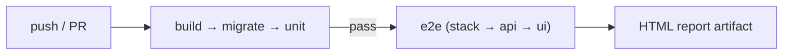
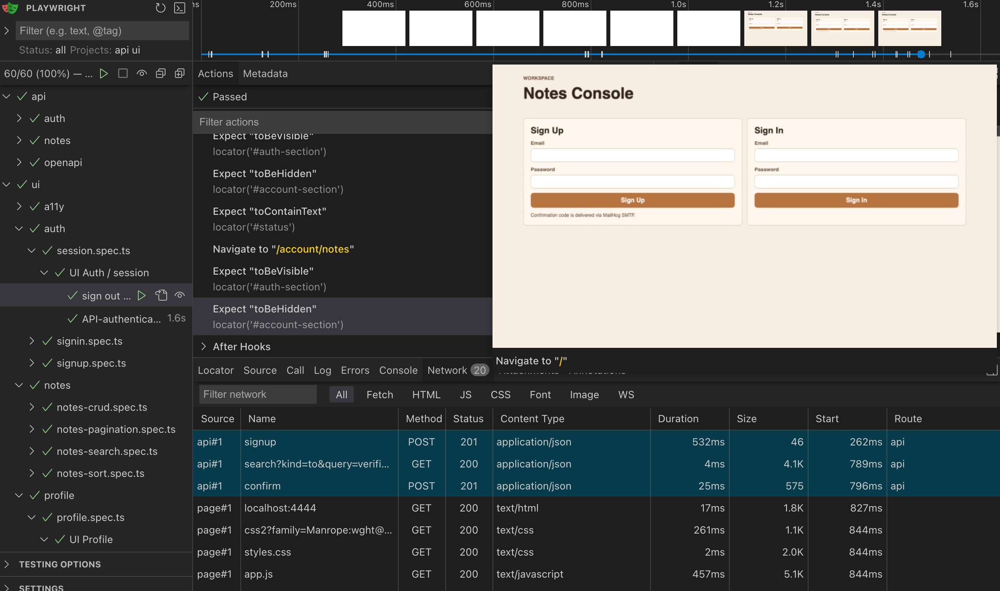

# Notes App — Test Automation (Playwright)

API and UI automated tests for the notes application.

Stack: **Playwright + TypeScript**, with **Zod** response schemas, **axe** a11y smoke, and **OpenAPI** contract smoke.

[](https://github.com/Balenciaga33/ps-aqa-tech-task/actions/workflows/ci.yml)

Related docs:
- [Test strategy](docs/TEST-STRATEGY.md)
- [Known issues](docs/KNOWN-ISSUES.md)
- [ADRs](docs/ADR.md)
- [Contributing](CONTRIBUTING.md)

## Prerequisites

Application stack must be running from the repository root:

```sh
make up && make install && make migrate
```

If `make install` fails without a TTY:

```sh
docker run --rm -v "$(pwd):/app" -w /app composer:2.9.3 install
make migrate
```

Services used by tests:

| Service | URL |
| --- | --- |
| App UI / API | http://localhost:4444 |
| API docs (UI) | http://localhost:4444/api/doc |
| API docs (JSON) | http://localhost:4444/api/doc.json |
| MailHog | http://localhost:8025 |

## Setup

```sh
cd automation
cp .env.example .env
npm install
npx playwright install chromium
```

Requires **Node.js 24+** (Active LTS).

Environment variables (see `.env.example`):

- `BASE_URL` — Playwright `baseURL` and default host for the app
- `API_URL` — optional override for HTTP clients (`src/config.ts`; defaults to `BASE_URL`)
- `MAILHOG_URL` — MailHog HTTP API

## Run tests

```sh
# All tests (API + UI)
npm test

# API / UI only
npm run test:api
npm run test:ui

# P0 blockers only (same filter used on pull_request CI)
npm run test:p0
npm run test:p0:api
npm run test:p0:ui

# Open HTML report
npm run test:report
```

From the repository root (app must already be up):

```sh
make test-e2e   # full Playwright suite
make test-api
make test-ui
make test-p0    # @p0 only
```

## Structure

```
automation/
  docs/                 # TEST-STRATEGY, KNOWN-ISSUES, ADR
  img/                  # local run evidence screenshots
  src/
    clients/            # Auth, Notes, MailHog HTTP clients
    fixtures/           # registeredUser, clients, page objects
    helpers/            # Auth bootstrap, data factory, a11y, OpenAPI
    pages/              # Auth / Notes / Profile + note modals
    schemas/            # Zod API response contracts
    types/
  tests/
    api/
      auth/             # signup, signin, confirm, me
      notes/            # crud, access, list, validation
      openapi/          # /api/doc.json contract smoke
    ui/
      auth/             # signup, signin, session
      notes/            # crud, search, sort, pagination
      profile/          # profile view
      a11y/             # axe smoke
  CONTRIBUTING.md
  playwright.config.ts
```

## Coverage snapshot

| Layer | Spec areas | Focus |
| --- | --- | --- |
| **API auth** | signup / signin / confirm / me | MailHog confirm chain, JWT, parameterized validation |
| **API notes** | crud / access / list / validation | CRUD, isolation, search/sort/pagination, boundary tables |
| **API contract** | openapi | Critical paths + documented statuses vs known drift (C1/C2) |
| **UI auth** | signup / signin / session | Onboarding, HTML5 blocks, logout / JWT bootstrap |
| **UI notes** | crud / search / sort / pagination | User-visible flows + known issues P2/P3 |
| **UI profile** | profile | Email + id |
| **UI a11y** | axe | Auth + notes serious/critical (A1/A2 allowlisted) |

Priorities and CI mapping: see [TEST-STRATEGY.md](docs/TEST-STRATEGY.md) (`@p0` on PR, full suite on `main`; **P2** = deferred scope, not pagination issue IDs).

## Design decisions

Rationale: [ADR.md](docs/ADR.md). Scope & priorities: [TEST-STRATEGY.md](docs/TEST-STRATEGY.md). Product quirks: [KNOWN-ISSUES.md](docs/KNOWN-ISSUES.md).

In short: risk-based `@p0`/`@p1`, API-first UI setup, Zod + OpenAPI contracts, axe smoke, assert actual behavior with `annotateKnownIssue`, `APP_MODE=healthy` only.

## CI pipeline



GitHub Actions (`.github/workflows/ci.yml`):

1. **`build → migrate → unit`** — cheap backend gate (PHPUnit)
2. **`e2e (stack → api → ui)`** — starts only if the gate passed (`needs: phpunit`)
   - one shared App + MailHog stack
   - on **pull_request**: `@p0` API then `@p0` UI
   - on **push to main**: full API then full UI

Outdated runs on the same branch are cancelled via `concurrency`.

## Evidence

Local run: full suite passed (API + UI) — see screenshot below.



CI: [GitHub Actions — CI workflow](https://github.com/Balenciaga33/ps-aqa-tech-task/actions/workflows/ci.yml) (badge at the top of this README). On failure (or for review), download the `playwright-report` artifact from a run.

## P.S.

I deliberately did **not** inflate the suite to chase “cover everything possible.” The focus is the **engineering** side: clear structure, risk-based priorities (`@p0` / `@p1`), maintainable fixtures and page objects, contracts (Zod + OpenAPI), documented findings with annotations, and a fail-fast CI pipeline that another engineer can run and review quickly.
