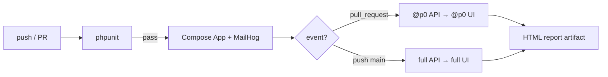

# Notes App — Test Automation (Playwright)

API and UI automated tests for the notes application.

Stack: **Playwright + TypeScript**, with **Zod** response schemas, **axe** a11y smoke, and **OpenAPI** contract smoke.

[](https://github.com/Balenciaga33/ps-aqa-tech-task/actions/workflows/ci.yml)

Related docs:
- [Test strategy](docs/TEST-STRATEGY.md)
- [Known issues](docs/KNOWN-ISSUES.md)
- [ADRs](docs/ADR.md)
- [Contributing](CONTRIBUTING.md)

## Prerequisites

Application stack must be running from the repository root:

```sh
make up && make install && make migrate
```

If `make install` fails without a TTY:

```sh
docker run --rm -v "$(pwd):/app" -w /app composer:2.9.3 install
make migrate
```

Services used by tests:

| Service | URL |
| --- | --- |
| App UI / API | http://localhost:4444 |
| API docs | http://localhost:4444/api/doc |
| MailHog | http://localhost:8025 |

## Setup

```sh
cd automation
cp .env.example .env
npm install
npx playwright install chromium
```

Requires **Node.js 24+** (Active LTS).

Environment variables (see `.env.example`):

- `BASE_URL` — app UI base URL
- `API_URL` — API base URL (defaults to same host)
- `MAILHOG_URL` — MailHog HTTP API

## Run tests

```sh
# All tests (API + UI)
npm test

# API / UI only
npm run test:api
npm run test:ui

# P0 blockers only (same filter used on pull_request CI)
npm run test:p0
npm run test:p0:api
npm run test:p0:ui

# Open HTML report
npm run test:report
```

From the repository root (app must already be up):

```sh
make test-e2e   # full Playwright suite
make test-api
make test-ui
make test-p0    # @p0 only
make test       # PHPUnit smoke (product)
```

## Structure

```
automation/
  docs/                 # TEST-STRATEGY, KNOWN-ISSUES, ADR
  src/
    clients/            # Auth, Notes, MailHog HTTP clients
    fixtures/           # registeredUser, clients, page objects
    helpers/            # Auth bootstrap, data factory, a11y, OpenAPI
    pages/              # Auth / Notes / Profile + note modals
    schemas/            # Zod API response contracts
    types/
  tests/
    api/
      auth/             # signup, signin, confirm, me
      notes/            # crud, access, list, validation
      openapi/          # /api/doc.json contract smoke
    ui/
      auth/             # signup, signin, session
      notes/            # crud, search, sort, pagination
      profile/          # profile view
      a11y/             # axe smoke
  CONTRIBUTING.md
  playwright.config.ts
```

## Coverage snapshot

| Layer | Spec areas | Focus |
| --- | --- | --- |
| **API auth** | signup / signin / confirm / me | MailHog confirm chain, JWT, parameterized validation |
| **API notes** | crud / access / list / validation | CRUD, isolation, search/sort/pagination, boundary tables |
| **API contract** | openapi | Critical paths + documented statuses vs known drift (C1/C2) |
| **UI auth** | signup / signin / session | Onboarding, HTML5 blocks, logout / JWT bootstrap |
| **UI notes** | crud / search / sort / pagination | User-visible flows + known P2/P3 |
| **UI profile** | profile | Email + id |
| **UI a11y** | axe | Auth + notes serious/critical (A1/A2 allowlisted) |

| Priority | CI | Meaning |
| --- | --- | --- |
| **@p0** | Every PR | Product unusable if broken |
| **@p1** | `main` (full suite) | Supporting behavior, validation matrices, a11y |
| **P2** | — | Deferred (visual / multi-browser / broken mode) |

## Priority matrix

| Priority | Meaning | Scenarios | Layer |
| --- | --- | --- | --- |
| **P0** | Product is unusable if broken | Signup → MailHog confirm → JWT; sign-in; notes CRUD; owner isolation; unauthorized access; OpenAPI critical paths | API + UI |
| **P1** | Important, but core still works | Validation tables; search; pagination; sort; profile; cancel delete/edit; axe a11y smoke | API + UI |
| **P2** | Nice-to-have / out of current suite | Visual regression; multi-browser matrix; `APP_MODE=broken`; expired-code wait | — |

## Design decisions

- **Risk-based**: critical auth and notes flows first; no visual regression or full browser matrix (Chromium only).
- **Independent tests**: unique email per run; no shared mutable fixtures between specs.
- **Fixtures**: `registeredUser`, typed clients, split page objects (`authPage`, `notesPage`, `profilePage`) via `test.extend`.
- **API-first UI**: JWT injected into `localStorage`; notes seeded via API; browser used for the behavior under test; network waits via `waitForResponse`.
- **Findings-aware**: assert actual behavior; document OpenAPI/UI/a11y mismatches in `docs/KNOWN-ISSUES.md`.
- **Contract-aware**: Zod on critical responses + OpenAPI smoke against `/api/doc.json`.
- **Parameterized validation**: shared assertion loops for email/password/title/content boundaries.
- **Healthy mode only**: tests assume `APP_MODE=healthy`.

## CI pipeline



GitHub Actions (`.github/workflows/ci.yml`):

1. **phpunit** — fast backend smoke (build image → migrate → PHPUnit)
2. **playwright** — starts only if phpunit passed (`needs: phpunit`)
   - one shared App + MailHog stack
   - on **pull_request**: `@p0` API then `@p0` UI
   - on **push to main**: full API then full UI

Outdated runs on the same branch are cancelled via `concurrency`.

Check the repository **Actions** tab for run status. On failure (or for review), download the `playwright-report` artifact.
